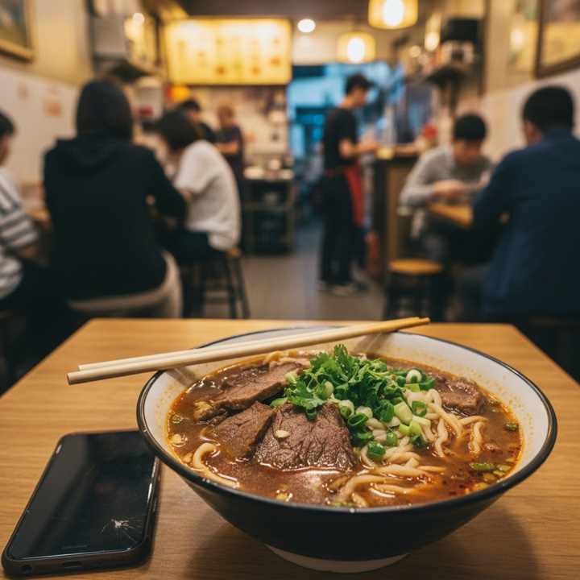

<div align="center">
  
  <h1>OpenMelon</h1>
  <p>A content-creation agent that runs in your terminal.</p>
</div>

OpenMelon turns content production into a single terminal session. Each project keeps its characters, references, and generated artifacts on disk; an LLM with tool-use drafts inside that context, anchored to the same character portraits across runs.

```bash
npm i -g @e8s/openmelon @e8s/skillplus
cd path/to/your-project
openmelon
```

First run walks through trust → API key → model → project init. Then you're in the TUI:

```
openmelon · ai-talks · openrouter:openai/gpt-5.5 · img:openrouter:openai/gpt-5.4-image-2

> Lao Wang grilling lamb skewers at the night market, neon reflections

  ⏺ list_characters({"query":"lao wang"})
    ⎿ [{"slug":"lao-wang","name":"Lao Wang",...}]
  ⏺ get_character({"slug":"lao-wang"})
    ⎿ {"image_paths":["/.../portrait.png"],...}
  ⏺ generate_image({"prompt":"...","reference_images":["/.../portrait.png"]})
    ⎿ {"path":".../draft-1.png","sha256":"..."}

⠋ Streaming response · 0:34 · 1.4k in / 312 out · esc to cancel
```

## Direct prompt vs OpenMelon

Same image model (`google/gemini-2.5-flash-image`), one shot each. The difference is the prompt path: direct prompting sends the user's intent straight to the image model; OpenMelon expands it through a [skillplus](https://github.com/eight-acres-lab/skillplus) package + LLM first.

<table>
  <tr>
    <th>Intent</th>
    <th>Direct prompt</th>
    <th>OpenMelon</th>
  </tr>
  <tr>
    <td><code>Grab a bowl of beef noodles after work and write an authentic restaurant-visit post.</code></td>
    <td></td>
    <td></td>
  </tr>
  <tr>
    <td><code>A cozy wooden cabin with warm lights, surrounded by a snowy pine forest at dusk.</code></td>
    <td></td>
    <td></td>
  </tr>
</table>

## Install

```bash
npm install -g @e8s/openmelon @e8s/skillplus
```

The npm package downloads the matching Go binary from GitHub Releases and verifies it against `SHASUMS256.txt`. To build from source:

```bash
go install github.com/eight-acres-lab/openmelon/cmd/openmelon@latest
```

## Configuration

`openmelon` (first run) walks through:

1. **Trust** — confirm the working directory. Trusted paths persist; subdirectories auto-trust.
2. **API key** — pick provider (OpenRouter / OpenAI / Anthropic), paste key. Stored at `~/.openmelon/credentials.json` (mode 0600). Detected env vars are offered for re-use.
3. **LLM model** — curated preset list, or custom.
4. **Image model** — curated preset list, custom, or skip.
5. **Project init** — writes `<workdir>/.openmelon/project.json` and `.gitignore`.

Re-run the auth steps with `openmelon setup`. Override per-project with `openmelon project set-key`.

## TUI commands

Type `/` inside the TUI to open the command palette:

| Command | Action |
|---|---|
| `/skill` | Pick a skillplus package for the next message |
| `/model` | Switch the LLM model (persists to `project.json`) |
| `/model-image` | Switch the image model |
| `/settings` | Bash permission mode |
| `/clear` | Forget conversation history |
| `/history` | Print the message log |
| `/save <path>` | Export the conversation as JSONL |
| `/session` | Print the session directory |
| `/exit` | Exit |

Keys: `↵` submit · `⇧↵` newline · `Esc` cancel turn · `Ctrl+C` ×2 quit · `↑/↓` / mouse wheel scroll.

## CLI

```
openmelon init [<id>]                      Set up the current directory as a project
openmelon project list | use | show        Manage / inspect projects
openmelon project set-key | unset-key      Per-project API key overrides
openmelon character add <slug> ...         Project character library
openmelon character list | show | rm
openmelon reference add <slug> ...         Project reference-image library
openmelon reference list | show | rm
openmelon material add <path>              Hash-addressed material pool
openmelon search "<query>"                 tag:foo · kind:character · -negative · "phrase"
openmelon setup                            Re-run the auth wizard
openmelon resume [<id>]                    List or load a prior session
openmelon -p "<intent>"                    Headless one-shot
```

## Bash tool

The agent can run shell commands via a `bash` tool. Every call is gated:

```
strict     Every command needs approval. Judge LLM only auto-blocks destructive ones. (default)
auto       Judge LLM auto-runs read-only inspection; writes prompt; destructive blocked.
trusted    Run anything without prompting. Use for throwaway projects only.
```

The approval modal offers three choices: yes, yes-and-always-allow-this-binary-for-the-session, no. Mode persists to `project.json:settings.bash_permission_mode`. Switch via `/settings`.

## Sessions

Every TUI run records the transcript and any generated artifacts under `<project>/.openmelon/sessions/<id>/`. After exit:

```
session saved at /path/to/.openmelon/sessions/20260506-101203-a1b2c3d4
to resume:    openmelon resume 20260506-101203-a1b2c3d4
```

`openmelon resume` lists recent sessions; `openmelon resume <id>` loads one into a fresh TUI with the prior conversation as context. The continuation runs in a new session directory; the original is immutable.

## How it works

Inside a project, the agent runs a tool loop. The model sees the project context plus a tool registry:

```
list_characters / get_character    pull people from the registry
list_references / get_reference    pull scenes, lighting, composition refs
search                             tag + substring grep across libraries
read_file                          read any file under the project workdir
compile_skill                      compile a skillplus package
generate_image (refs[])            image model with optional anchor images
save_artifact                      promote a session image to a final artifact
bash                               shell, gated by the permission mode
finish                             end the loop with a summary
```

Search is grep, not vectors. Each character / reference has a one-line description plus 1–10 kebab-case tags in a `.search` file.

`openmelon -p "<intent>"` runs the same stack headless — useful for scripts and sub-agent integration.

## Layout

```
~/.openmelon/
  config.json                      defaults + trusted_dirs
  credentials.json                 mode 0600, per-provider api keys
  projects.json                    project id → workdir registry

<project>/.openmelon/
  project.json                     name, persona, defaults, settings
  credentials.json                 mode 0600, per-project key overrides
  .gitignore                       excludes credentials.json + sessions/
  characters/<slug>/               character.json + .search + portraits
  references/<slug>/               reference.json + .search + image
  materials/<sha-prefix>/          hash-addressed raw inputs
  sessions/<ts>-<rnd>/             messages.jsonl, meta.json, generated images
  artifacts/<slug>/<ts>/           final outputs from save_artifact
```

## Integrations

Skill files for Claude Code and Cursor are in [`examples/integrations/`](examples/integrations/). They shell to `openmelon -p "$intent"`.

## License

[Apache 2.0](LICENSE).

## Friendly Links

- [LINUX DO](https://linux.do/) — This open-source project recognizes and links to the LINUX DO community.
